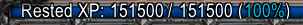

# Rested

A simple and lightweight rested XP info text for your XP bar.

It will show your current rested XP on the bar and a percentage of how rested you are.

**Note:** Although you can be *150%* rested (*of you current level*), the text will show it as *100%* (*like "you are completely rested and can leave the tent/town now"*).

## Install

### Turtle WoW Launcher

Click on the **<>Code**-Button, select **HTTPS** and copy the URL.

Then open the **ADDONS**-tab in your TWoW-Launcher, select **+ Add new addon**, paste the URL and click **Install**.

### Manual
Copy this folder (`Rested`) into the `\Interface\AddOns` folder of your WoW installation.